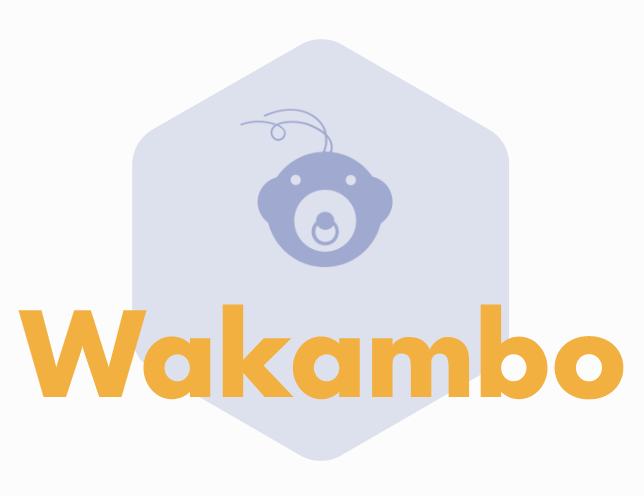

# Wakambo

Simple MVP (minimum viable product) demo of an emotion recognition system.   

   

> This project is part of the Management module on the "Master 2 - Informatique et ingénierie des systèmes complexes" at CY Cergy Paris Université. Therefore, it has an academic purpose.   


## Requirements

Python >= 3.9.2

```
pip install -r requirements.txt
```